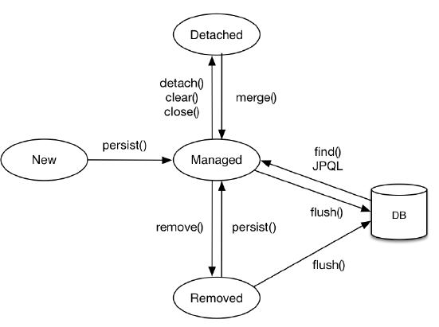
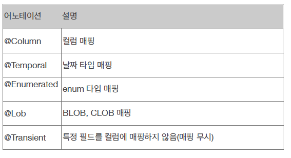
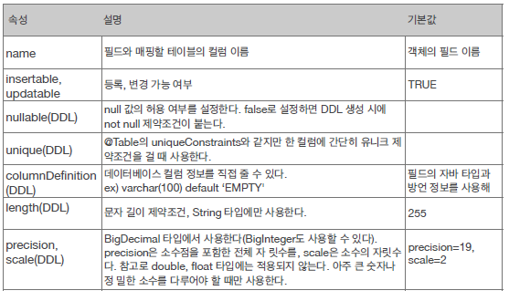
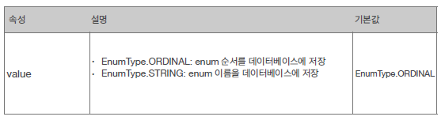
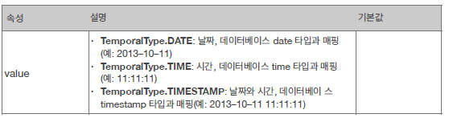
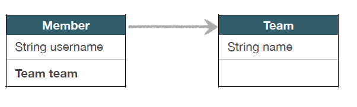
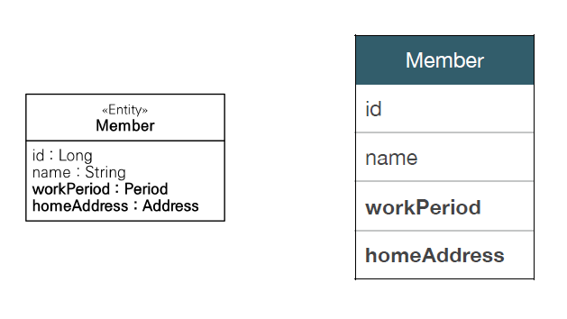
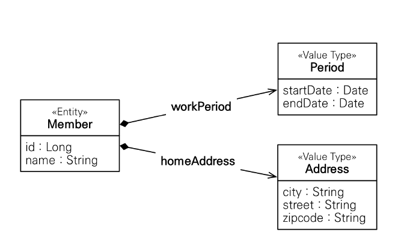
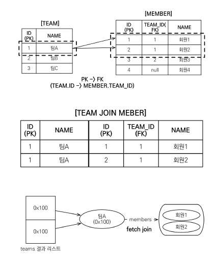

# 학습 목적
- 자바 표준 ORM 기술인 JPA의 연관관계 매핑과 연관관계에 따른 쿼리를 실행 했을 때 내부 구조에 따른 동작방식을 이해
- 출처: [자바 ORM 표준 JPA 프로그래밍 - 기본편-](https://www.inflearn.com/course/ORM-JPA-Basic/dashboard)

## 학습 목차

- [소개](#소개)
- [영속성 관리](#영속성-관리)
- [엔티티 맵핑](#엔티티-맵핑)
- [연관관계 맵핑](#연관관계-맵핑)
- [프록시와 연관관계 관리](#프록시와-연관관계-관리)
- [값 타입](#값-타입)
- [객체지향 쿼리 언어](#객체지향-쿼리-언어)

### 소개
- JPA는 Java Persistence API의 약어로, 자바 진영의 ORM 기술 표준이다.
- 객체는 객체지향적으로 설계하고 데이터베이스는 관계지향형으로 설계할 수 있도록 ORM 프레임워크가 중간에서 매핑역할을 해준다.
- JPA는 애플리케이션과 JDBC 사이에서 동작한다.

#### JPA를 사용해야 하는 이유
- 과거 개발자는 SQL 중심적인 개발을 했기 때문에 다양한 객체들을 SQL로써 맵핑을 해주어야 하는 고충이 있었다.
- 또한 자바의 객체지향 설계의 패러다임과 관계형 데이터 베이스의 패러다임이 불일치 했기 때문에 객체의 설계 방식에 어려움이 있엇다.
- JPA는 객체 중심개발을 하도록 도와주고, 이것은 곳 생산성과 유지보수 측면에서 효율적이라고 할 수 있다.
- 직접 쿼리를 만들지 않아도 JPA 내장 함수를 사용하면 기본적인 쿼리(CRUD)를 만들어 준다.
- 영속성 컨텍스트와, 쓰기 지연, 지연 로딩등 성능 최적화를 위한 다양한 기능들을 제공한다.

-----------
### 영속성 관리

#### 영속성 컨텍스트

- '엔티티를 영구 저장하는 환경'으로 entityManager를 통해 이곳에 접근하고, 데이터를 저장하거나 조회할 때 이곳을 접근하고 엔티티를 영속성 컨텍스트 1차 캐시에 저장하게 된다.

- 영속성 컨텍스트는 entityManager를 통해 트랜잭션이 생길때마다 한 개씩 생성된다.

- 영속성 컨텍스트 안에는 1차 캐시라는 캐시가 있는데, 이곳에 있는 엔티티는 기본키 값과 엔티티를 한 쌍으로 맵 구조로 저장되어 있고,
같은 엔티티를 조회할 때는 쿼리를 호출하지 않고 이곳에서 데이터를 조회한다. 캐시에 없다면 쿼리를 호출하고 해당 엔티티를 캐시에 저장한다.

-  같은 엔티티를 호출하여 서로 다른 객체에 저장해도 **동일성**을 보장한다. 
    ```
    Member a = em.find(Member.class, "member1");
    Member b = em.find(Member.class, "member1");
    System.out.println(a == b); //동일성 비교 true
    ```
- 트랜잭션을 지연하는 쓰기 지연 기능을 제공한다. 아래의 코드 처럼 영속성 컨텍스트에 해당 엔티티를 저장해두고, 쓰기 지연이 일어난 **SQL 저장소**에 쿼리를 저장하고, 커밋이나 플러시가 일어나는 순간 쿼리를 한번에 보낸다.
     ```
    EntityManager em = emf.createEntityManager();
    EntityTransaction transaction = em.getTransaction();
    //엔티티 매니저는 데이터 변경시 트랜잭션을 시작해야 한다.
  
    transaction.begin(); // [트랜잭션] 시작
    em.persist(memberA);
    em.persist(memberB);
    //여기까지 INSERT SQL을 데이터베이스에 보내지 않는다.
    //커밋하는 순간 데이터베이스에 INSERT SQL을 보낸다.
  
    transaction.commit(); // [트랜잭션] 커밋
    ```
- JPA로 데이터를 수정하고 싶을때는 해당 엔티티를 조회해서 수정하면 된다.  
마지막으로 조회가 일어난 캐시를 **스냅샷**으로 저장해두었다가 트랜잭션이 커밋되거나 플러시가 될 때 비교하여 **엔티티의 변경을 감지**하고 
변경이 일어났다면 수정쿼리를 DB에 호출한다.

- 플러시는 flush()를 직접호출하거나 트랜잭션 커밋이 일어날때 발생하고, JPQL 쿼리를 실행하면 자동으로 일어난다. 
플러시가 일어났다고해서 영속성 컨텍스트가 비워지는 것이 아니라 1차 캐시의 엔티티의 정보를 데이터베이스와 **동기화** 한다.

컨텍스트를 준영속 상태로 - 영속성 만들고 싶다면 clear()를 통해 완전 초기화 할 수 있고, detach(entity)를 통해 특정 엔티티만 준영속 상태로 전환할 수 있다.

#### 엔티티의 생명주기


- 비영속(new/transient): 영속성 컨텍스트와 전혀 관계가 없는 새로운 형태

- 영속(managed): 영속성 컨텍스트에 관리되는 상태

- 준영속(detached): 영속성 컨텍스트에 저장되었다가 분리된 상태

- 삭제(removed): 삭제된 상태

-----------

### 엔티티 맵핑

#### 방식

- 맵핑하고 싶은 객체에 각종 어노테이션을 추가함으로써 엔티티 맵핑을 지원한다.

- 객체와 테이블 맵핑
    - @Entity: JPA가 해당 객체를 엔티티로써 관리할 것이라고 명시한다는 의미이고, 테이블을 자동으로 생성한다.
      
         - 이 어노테이션을 사용하려면 기본 생성자는 필수이다.
         - final, enum, interface, inner 클래스는 사용이 불가능하다.
         - 해당 클래스 필드에 final을 선언하면 안된다.

    - @Table: 엔티티와 매핑할 테이블을 지정할 수 있고 추가적인 옵션을 제공한다.
    
- 필드와 컬럼 맵핑

    - 종류
    
    
   
    - @Column
    
    
    
    - @Enumerated
    
    
    
    - @Temporal
        
    
    
    - @Lob : 데이터베이스 BLOB, CLOB 타입과 매핑 된다. 매핑하는 필드 타입이 문자면 CLOB, 그외는 BLOB이다.
    
    - @Transient : 해당 어노테이션이 있으면 필드로 매핑하지 않는다. 즉 데이터베이스에 저장하지 않는다. 클래스 내부에서 임시적으로
    사용하고 싶을때 사용한다.

- 기본기 매핑

    - @Id: 기본키로 쓰고 싶은 객체의 필드에 추가
    - @GeneratedValue: 키값을 자동으로 생성해주는데 JPA에선 4가지 전략을 제공한다.
        - IDENTITY
            - 기본키 생성 책임을 데이터베이스에게 위임한다. 주로 MySQL, PostgreSQL, SQL Server에서 사용된다.
            그런데 JPA는 보통 트랜잭션 커밋 시점에 쿼리를 호출한다. 따라서 커밋이 일어나기전에 해당 식별자를 조회할 수 없다.
            하지만 이 전략을 사용하면 persist() 시점에 즉시 쿼리를 실행함으로써 DB에서 식별자를 조회할 수 있다.
        - SEQUENCE
             - 데이터베이스 시퀀스는 유일한 값을 순서대로 생성하는 특별한 데이터베이스 오브젝트(예: 오라클 시퀀스)이고 
             주로 오라클 에서 사용한다.

                 ```
               @SequenceGenerator(
                       name = “MEMBER_SEQ_GENERATOR",
                       sequenceName = “MEMBER_SEQ", //매핑할 데이터베이스 시퀀스 이름
                       initialValue = 1, allocationSize = 1)
               public class Member {
                   
                   @Id
                   @GeneratedValue(strategy = GenerationType.SEQUENCE,
                                generator = "MEMBER_SEQ_GENERATOR")
                   private Long id;
               
               ...이하 생략
                 ```

        - TABLE
            - 키 생성 전용 테이블을 하나 만들어서 데이터베이스 시퀀스를 흉내내는 전략으로 모든 
            데이터베이스에 적용이 가능하지만 성능이 저하될 수 있는 문제가 있다.
            
                ```
              @Entity
              @TableGenerator(
                      name = "MEMBER_SEQ_GENERATOR",
                      table = "MY_SEQUENCES",
                      pkColumnValue = “MEMBER_SEQ", allocationSize = 1)
              public class Member {
                  @Id
                  @GeneratedValue(strategy = GenerationType.TABLE,
                                 generator = "MEMBER_SEQ_GENERATOR")
                  private Long id;
                ```
            
        - AUTO: 방언(H2,MySQL,ORACLE, etc)에 따라 자동 지정, 기본값
        
    - 권장하는 식별자 전략은 **Long형 + 대체키 + 위의 4가지 키 생성 전략**중 한가지를 조합하여 사용한다.
-----------------------

### 연관관계 맵핑
- 객체를 데이터베이스 테이블에 맞추어 모델링하면 연관된 객체를 필드에 두지 않고 외래키를 필드로 설정 함으로써
객체를 한번더 찾아야된다. -> **객체간 참조거리가 멀어진다.** 따라서 연관관계 맵핑을 통해 해결한다.

- 연관관계 맵핑에는 단방향, 양방향 두 가지가 존재 한다.
    
    - 단방향 맵핑은 객체의 참조와 테이블의 외래키를 맵핑하면 된다.
        ```
          @ManyToOne
          @JoinColumn(name = "TEAM_ID")
          private Team team;
        ```
    - 양방향 맵핑은 연관된 두 엔티티에 서로 단방향 맵핑을 적용하면 된다.
         ```
          @ManyToOne
          @JoinColumn(name = "TEAM_ID")
          private Team team;
            ...
         ```
      
      ```
       @OneToMany(mappedBy = "team")
       List<Member> members = new ArrayList<Member>();
        ...
      ```
        - 양방향 맵핑 관계를 적용할 때에는 연관관계의 주인을 설정해야 하는데, 이 때 주인만이 외래키를 관리(등록, 수정)할 수 있다.
        주인이 아닌 쪽은 조회(읽기)만 가능하다. 주인이 아닌 엔티티가 mappedBy 속성을 사용한다.
        
        - 양방향 맵핑시에는 toString(), Lombok, JSON 생성 라이브러리 사용 시에 발생하는 **무한루프**를 고려해서 적용해야 한다.
        
        - 양방향 맵핑을 항상 설정하지 말고, 필요시 에만 설정하는 것이 좋다. 양방향은 실제 테이블의 연관관계와는 아무런 상관이 없기 때문이다.
    
- 방식
    - @ManyToOne: N:1
    
        - 외래키가 있는 곳이 연관관계의 주인이다. 보통 N 쪽이 주인이다.
        
    - @OneToMany: 1:N
    
        - 일대다 단방향은 일(1)이 연관관계의 주인이다. 그러나 테이블 일대다 관계는 항상 다(N) 쪽에 외래 키가 있음
        
        - 객체와 테이블의 차이 때문에 반대편 테이블의 외래 키를 관리하는 특이한 구조이다. 
        그렇기 때문에, @JoinColumn을 꼭 사용해야 함. 그렇지 않으면 조인 테이블 방식을 사용함(중간에 테이블을 하나 추가함)
        
        - 권장하지 않는 맵핑 방식
    
    - @OneToOne: 1:1
    
        - 주 테이블이나 대상 테이블 중에 외래 키 선택 가능하다. 외래 키에 데이터베이스 유니크(UNI) 제약조건 추가해야 한다.
        
        - 대상 테이블에 외래 키 단방향 관계는 JPA가 지원하지 않는다. 하지만 양방향은 지원한다.
        
    - @ManyToMany: N:M
    
        - 사실 관계형 데이터베이스는 정규화된 테이블 2개로 다대다를 표현할 수 없다.
        
        - 두 테이블을 연결해주는 테이블을 추가적으로 만들어서 일대다, 다대일 관계로 풀어서 결과적으로 다대다인 것처럼 맵핑시켜야 한다.
        
        - @JoinTable을 통해 추가된 테이블을 연관시켜준다.
        
- 상속관계 맵핑

    - 사실 관계형 데이터베이스에서 상속 관계는 존재하지 않는다.
    
    - 따라서 비슷한 슈퍼타입과 서브타입 관계라는 모델링 기법을 사용한다.
    
        - 실제 물리 모델로 구현하는 방법은 3 가지다. @Inheritance 어노테이션을 사용하고 strategy 옵션을 추가한다.
            
            1. 각각의 테이블로 변환시켜 조인한다. -> 조인 전략 (strategy=InheritanceType.JOIN)
                - 테이블을 정규화할 수 있고, 외래키 참조 무결성 제약조건을 활용, 저장공간 효율적으로 사용할 수 있다는 장점이 있다.
                
                - 그러나 조회시 조인을 많이 사용할 수 있고, 조회 쿼리가 복잡할 뿐만아니라 데이터 저장시 삽입 쿼리를 두번 호출하는 단점이 존재한다.
            
            2. 통합 테이블을 만든다. -> 단일 테이블 전략 (strategy=InheritanceType.SINGLE_TABLE)
            
                - 조회 성능이 빠르고, 쿼리가 단순하다는 장점이 있다.
                
                - 자식 엔티티가 매핑한 컬럼은 모두 null을 허용 하고, 단일 테이블이다 보니 테이블이 너무 커지게 되면 조회 성능이 저하 된다는 단점이 있다.
            
            3. 서브타입 테이블로 변환 -> 구현 클래스마다 테이블을 다 생성하는 전략 (strategy=InheritanceType.TABLE_PER_CLASS)
            
        - @MapperdSuperclass
         
            - 테이블마다 공통 매핑 정보가 있을 떄 사용한다.
         
            - 상속관계 매핑이 아닐 뿐 만 아니라 엔티티로 취급하지 않는다. 따라서 테이블과 매핑되지 않는다.
            
            - 위의 이유로 조회, 검색이 불가능하다.
            
            - 보통 추상클래스로 만드는 것을 권장한다.
    
---------------

### 프록시와 연관관계 관리

#### 프록시의 특징
- 프록시객체는 엔티티를 조회할 때 지연 로딩을 사용함으로써 필요할 때마다 데이터를 불러오기 위해 사용된다.

- 프록시 객체는 entityManager.getReference(entity)를 통해 만들어지고 이때 실제 엔티티의 클래스를 상속받는다.
나중에 진짜 데이터를 받아와야 하기 때문에, **실제 객체의 잠조를 갖고있다.**

- 프록시 객체는 처음 사용할 때 한 번만 초기화 된다. 초기화가 될 때, 객체를 통해서 실제 엔티티에 접근이 가능하다.

- 만약 필요한 엔티티가 이미 영속성 컨텍스트에 있다면 getReference()를 호출해도 실제 엔티티를 반환한다.

- 준영속 상태의 엔티티는, 프록시를 초기화하면 문제가 발생한다.(Hibernate -> org.hibernate.LazyInitializationException 발생)

#### 즉시 로딩과 지연 로딩

- 지연 로딩
    
    - 지연 로딩을 하고 싶은 필드는 연관관계 매핑 옵션에 fetch = FetchType.LAZY를 추가한다. 이렇게 되면 em.find를 해도 해당 필드는 프록시
    엔티티가 생성되고 실제로 정보가 채워져있지 않게 된다. 실제로 사용하게 되면 그때서야 초기화한다.
    
- 즉시 로딩
    - 만약 지연 로딩이 아니라 항상 해당 필드가 필요하다면  fetch = FetchType.EAGER를 추가하여 엔티티를 호출할때 한번에 데이터를 가져오게 한다.
    
    - 가급적이면 지연로딩을 사용하는게 성능면에서 좋다. 즉시 로딩을 적용하면 예상하지 못한 SQL이 발생할 수 있다.(N+1 문제)
    
        - N+1 문제
        
           - 만약 어떤 엔티티를 조회 하기 위하여 쿼리를 1 번 호출했을때 나온 결과를 생성하기 위해 N번의 쿼리가 더 추가 되는 것을 말한다.
           
           - N+1 호출로 인해 성능이 많이 저하된다.
           
           - 만약 Member와 Team의 관계가 아래의 그림과 같다고 하자.
           
                
            
                a. 서로 다른 팀을 가진 100개의 Member 데이터가 DB에 저장되어 있다.
                
                b. 나는 Member 테이블의 모든 정보를 알고 싶다.
                
                c. Member 테이블을 모두 가져오기 위해 JPQL을 통해 em.createQuery("select m from Member m", Member.class)를 호출했다.
                
                d. 이 쿼리가 호출되면서 JPA는 Member 내부의 Team까지 조회하기 위해 외래키를 통해 해당 멤버의 각팀을 모두 호출한다.
                
                e. **결론 적으로 1(Member를 조회하기 위한 쿼리) + 100(멤버마다 각각 다른 팀을 조회하기 위한 쿼리) = 101 번이 호출한다.**
                
           - **@ManyToOne, @OneToOne은 기본이 즉시 로딩이므로 웬만하면 fetch 옵션에 LAZY를 추가해주자.**
           
#### 영속성 전이: CASCADE

- 특정 엔티티를 영속 상태로 만들 때 연관된 엔티티도 영속 상태로 만들고자 할 때 사용 된다.
(ex: 부모 엔티티를 저장할 떄 자식 엔티티도 함께 저장)

- 연관관계 매핑시 cascade 옵션을 추가하면 된다. 자주 사용되는 종류는 다음과 같다.
    
    - ALL:모두 적용
    
    - PERSIST: 영속
    
    - REMOVE: 삭제 
    
    - MERGE: 병합

- 영속성 정의는 연관관계를 매핑하는 것과 아무런 관련이 없다. 엔티티를 영속화할 떄 연관된 엔티티도 함꼐 영속화하도록 편의기능을 제공하는 것이다.


#### 고아 객체

- 부모 엔티티와 연관관계가 끊어진 자식 엔티티를 의미한다.
    
    ```
      Parent parent1 = em.find(Parent.class, id);
      parent1.getChildren().remove(0);
      //자식 엔티티를 컬렉션에서 제거
    ```

- 이 상태에서 orphanRemoval = true가 1:N 관계에서 1에 추가되면 이 객체를 삭제해준다.

- 참고로 이 옵션은 엔티티가 참조를 한곳에만 할때에 사용해야 한다. 그렇지 않으면 다른 참조가 있는 곳에서도 삭제가 일어나기 때문에
의도하지 않은 삭제가 일어날 수 있다.

#### 영속성 전이 + 고아 객체, 생명주기

- CascadeType.ALL + orphanRemovel=true를 추가한 엔티티는 관련된 엔티티의 생명주기를 직접 관리하게 된다.
즉 부모 엔티티를 통해서 자식 엔티티의 생명주기를 관리하게 된다.

- 도메인 주도 설계(DDD)의 Aggregate Root를 구현할 때 유용하다고 한다.

 --------------------
 
 ### 값 타입
 
 #### 기본 값 타입
 
 - 생명주기를 엔티티에 의존한다. ex) Member를 삭제하면 이름, 나이 필드도 함께 삭제 된다.
 
 - 값 타입은 공유하면 안된다. 왜냐하면 해당 값을 사용하는 곳에서 의도하지 않은 수정이나 삭제가 발생할 수 있다.
 
 - JPA의 데이터 타입 분류
    
    - 엔티티 타입
    
        1. @Entity로 정의하는 객체
        
        2. 데이터가 변해도 식별자로 지속해서 추적 가능
        
    - 값 타입 (기본값, 임베디드, 컬렉션)
    
        - int, Integer, String ㅊ럼 단순히 값으로 사용하는 자바 기본 타입이나 객체
        
        - 식별자가 없고 값만 있으므로 변경시 추적 불가
    
 #### 임베디드 타입
 
 - 새로운 값 타입을 직접 정의할 수 있다. JPA는 임베디드 타입이라고 한다.
 
 - 주로 기본 값 타입을 모아서 만들며, 복합 값 탕비이라고 한다.
 
 - 예시로 회원 엔티티는 이름, 근무 기간, 집 주소를 가진다.
     
     
     
     
     
    - Period와 Address를 임베디드 타입으로 정의했다. 해당 기능을 사용하기 위해선 해당 클래스에 @Embeddable 어노테이션을 추가한다.
    
    - 사용하는 Member의 Period와 Address 필드에 @Embedded를 추가할 수 있다.
    
    - 추가하지 않아도 자동적으로 임베디드 타입으로 추가되지만 명시하기 위해 추가하는 것이 좋다고 한다.
    
 - 장점
    
    - 재사용할 수 있다.
    
    - 특정 임베디드 타입의 값만 사용하는 메소드를 작성할 수 있따.
    
    - 임베디드 타입을 포함한 모든 값 타입은 값 타입을 소유한 엔티티에 생명주기를 의존한다.
    
 - 임베디드 타입과 테이블 매핑에서 임베디드 타입은 엔티티의 값일 뿐이다. 즉 임베디드를 사용하지 않아도
 매핑하는 테이블의 형태는 같다는 의미이다.
 
 - 하지만 데이터베이스와 달리 객체지향 프로그래밍을 추구한다면, 임베디드 타입을 적극 사용하는 것이 좋다.
 
 #### 값 타입과 불변 객체
 
 - 값 타입의 용도는 복잡한 객체 세상을 조금이라도 단순화하려고 만든 개념이다. 따라서 값 타입은 단순하고 안전하게 다룰 수 있어야 한다.
 
 - 임베디드 타입 같은 값 타입을 여러 엔티티에서 공유하면 위험하다고 임베디드 타입 파트에서 언급했다.
 
 - 따라서 따로 인스턴스를 복제하여 사용해야 한다. 문제는 항상 이렇게 복사해서 사용한다고 좋은 것이 아니다.
 
 - **임베디드 타입처럼 직접 정의한 값 타입은 자바의 기본 타입이 아니라 객체 타입이다.**
 
 - **객체 타입은 참조 값을 직접 대입하는 것을 막을 방법이 없고, 공유 참조역시 피할 수 없게 된다.**
 
 - 따라서 객체 타입을 불변 객체로 만들어서 앞서 언급한 부작용을 차단해야 한다.
 
 - **생성자로만 값을 정할 수 있게 하고 수정자(Setter)를 만들지 않도록 하자.**
 
 ----------------

### 객체지향 쿼리 언어
- JPA는 다양한 쿼리 방법을 지원
    
    - JPQL, JPA Criteria, QueryDSL, Native SQL, JDBC API, MyBatis, SpringJdbcTemplate
    
#### JPQL (Java Persistence Query Language)

- JPA를 사용하면 엔티티 객체를 중심으로 개발한다. 문제는 검색을 할 때도 테이블이 아닌 엔티티 객체를 대상으로 검색한다.

- 모든 데이터베이스에 있는 데이터를 객체로 변환해서 검색하는 것은 사실상 불가능 하다.

- 결국 필요한 데이터만 검색할 수 있는 SQL이 필요하다. -> **JPQL**

- **JPQL은 SQL을 추상화한 객체지향 쿼리 언어이다.** 이 말은 쿼리를 엔티티 객체 대상으로 호출 할 수 있다. 호출 되고 결국 SQL로 변환된다.

- 따라서 SQL에 의존하지 않는다. JPQL을 다른말로 객체 지향 SQL로 부르기도 한다.

- 예시

    ```
      String jpql = "select m from Member m where m.age > 18";
      List<Member> result = em.createQuery(jpql, Member.class)
                            .getResultList();
    ```
  
    ```
    실행된 SQL
          select
              m.id as id,
              m.age as age,
              m.USERNAME as USERNAME,
              m.TEAM_ID as TEAM_ID
          from
              Member m
          where
              m.age>18
    ```
- 기본 문법
    
    - 엔티티와 속성(필드)는 대소문자를 구분한다. 반면에 JPQL 키워드는 구분하지 않는다.
    
    - 엔티티의 **alias(별칭)**이 필수 이다.(as 생략가능)
    
    - 기본적인 SQL 집계함수와 GROUP BY, HAVING, ORDER BY를 지원한다.
    
    - 반환 타입이 명시되있으면 TypeQuery 타입을 사용하고, 그렇지 않다면 Query를 사용한다.
    
    - 결과가 하나 이상이면 getResultList()를 사용하고, 그렇지 않다면 getSingleResult()를 사용하는데 이것은 반드시
    결과가 한 개여야 한다. 그렇지 않으면, javax.persistence.NoResultException, javax.persistence.NonUniqueResultException과 같은 예외가 발생한다.
    
    - 파라미터 바인딩 - 이름 기준, 위치 기준 예시
    ```
    SELECT m FROM Member m where m.username=:username
    query.setParameter("username", usernameParam);
    ```
    ```
    SELECT m FROM Member m where m.username=?1
    query.setParameter(1, usernameParam);
    ```
    - 프로젝션
        
        - SELECT 절에 조회할 대상을 지정하는 것을 의미한다.
        
        - 대상은 엔티티, 임베디드 타입, 스칼라 타입이 해당된다.
        
        - SQL과 마찬가지로 distinct(중복 제거)를 지원한다.
        
        - 예시
            ```
            1. SELECT m FROM Member m -> 엔티티 프로젝션
            2. SELECT m.team FROM Member m -> 엔티티 프로젝션
            3. SELECT m.address FROM Member m -> 임베디드 타입 프로젝션
            4. SELECT m.username, m.age FROM Member m -> 스칼라 타입 프로젝션
            ```
        - 여러 값을 조회 할 때는 Query(봔한 타입을 모를 때)타입, Object[] 또는 DTO를 정의하여 조회한다.
        
        - DTO로 조회할 때에는 패키지 명을 포함한 전체 클래스 명을 입력해야 하고, 순서와 타입이 일치하는 생성자가 필요하다.
        
    - 페이징 API
        
        - JPA는 페이징을 다음 두 API로 추상화 했다.
        
            1. setFirstResult(int startPosition) : 조회 시작 위치 (0부터 시작)
            
            2. setMaxResults(int maxResult) : 조회할 데이터 수
            
     - 조인
     
        - SQL방식과 거의 동일하며 INNER 조인과 OUTER 조인시 JOIN키워드만 넣고 ON절을 사용할 수 있다.
        
     - 서브쿼리
     
        - IN, EXITS, NOT, ALL, ANY, SOME과 같은 함수를 제공하며 FROM 절에는 서브쿼리를 작성할 수 없다.
        
        - 예시
            
            ```
              1. 팀A 소속인 회원
                  select m from Member m
                  where exists (select t from m.team t where t.name = ‘팀A')
              
              2. 전체 상품 각각의 재고보다 주문량이 많은 주문들
                  select o from Order o
                  where o.orderAmount > ALL (select p.stockAmount from Product p)
              
              3. 어떤 팀이든 팀에 소속된 회원
                  select m from Member m
                  where m.team = ANY (select t from Team t)
            ```
        - FROM 절의 서브쿼리를 지원하지 않기 때문에 조인을 풀어서 사용하거나, 
        Native Query와 같은 SQL에 의존하는 쿼리를 사용해서 해결한다.

#### JPQL 경로 표현식

   - .(점)을 통해 엔티티를 탐색하는 것이다.
    
        ```
          select m.username -> 상태 필드
           from Member m
            join m.team t -> 단일 값 연관 필드
            join m.orders o -> 컬렉션 값 연관 필드
          where t.name = '팀A'
        ```
        - 상태 필드: 단순히 값을 저장하기 위한 필드이다. 경로 탐색의 끝이며, 더 이상 탐색이 불가능 하다.
        
        - 연관 필드: 연관관계를 위한 필드
        
            - 단일 값 연관 필드: @ManyToOne, @OneToOne 등이 있고, 묵시적 내부 조인이 발생한다. 더 깊게 탐색할 수 있다.
            
            - 컬렉션 값 연관 필드: @OneToMany, @ManyToMany 등이 있고, 묵시적 내부 조인이 발생하지만 더 이상 탐색이 불가능 하다.
            탐색하고 싶다면 FROM 절에서 명시적 조인을 통해 alias(별칭)을 얻으면 이것을 통해 탐색 할 수 있다.
            
                ```
                ex) select m.username from Team t join t.members m
                ```
   - 명시적 조인, 묵시적 조인
    
        - 명시적 조인: join 키워드를 직접 사용한다.
        
        - 묵시적 조인: 경로 표현식에 의해 묵시적으로 SQL 조인이 발생하는 것이다.
        
            - 묵시적 조인은 항상 내부 조인을 호출한다.
            
            - 가급적 이면 명시적 조인을 사용해서 조인이 일어나는 상황을 실행되기전에 명시하도록 하자.
#### JPQL fetch join

- SQL에서 사용되는 조인의 종류가 아니라, JPQL에서 성능 최적화를 위해 제공하는 기능이다.

- 연관된 엔티티나 컬렉션을 SQL 한 번에 함께 조회하는 기능을 의미한다.

    ```
    예시
    [JPQL 실행]
    select m from Member m join fetch m.team
  
    [실행후 호출 된 SQL]
    SELECT M.*, T.* FROM MEMBER M
    INNER JOIN TEAM T ON M.TEAM_ID=T.ID
    ```
    
    - SQL을 보면 회원 뿐만 아니라 팀(T.*)도 함께 SELECT 되는 것을 확인 할 수 있다.
            
    - 페치 조인을 사용함으로써 지연 로딩이 설정 되있던 것이 즉시 로딩 된다.       

- 일대다 관계에서의 페치 조인
  
  ```
  String jpql = "select t from Team t join fetch t.members where t.name = '팀A'"
  List<Team> teams = em.createQuery(jpql, Team.class).getResultList();

  for(Team team : teams) {
    System.out.println("teamname = " + team.getName() + ", team = " + team);
    for (Member member : team.getMembers()) {
        //페치 조인으로 팀과 회원을 함께 조회해서 지연 로딩 발생 안함
        System.out.println(“-> username = " + member.getUsername()+ ", member = " + member);
  }
  }
  ```    
  
  
  
  - 그림 상에는 결과 값이 문제가 없지만 
  실제로 호출하면 중복 현상이 발생하여 결과 값이 더 커지는 일이 발생한다. 
  
       ```
       teamname = 팀A, team = Team@0x100
       -> username = 회원1, member = Member@0x200
       -> username = 회원2, member = Member@0x300
       teamname = 팀A, team = Team@0x100
       -> username = 회원1, member = Member@0x200
       -> username = 회원2, member = Member@0x300
        ... 생략
       ```
  - 내부적 어떤 일이 발생했을까
    
    - TEAM 입장에서 MEMBER와 페치 조인을 하기 되면 '팀A'의 이름을 튜플이 2개가 만들어진다.
    
    - '회원1'과 '회원2'는 같은 팀 '팀A'에 속해있고 이로 인해 '팀A'가 속한 결과 리스트가 2가 똑같이 만들어지게 되고
    1이라는 PK를 갖고 있기 떄문에 똑같은 엔티티가 2개가 만들어 진다.  
    - 따라서 t를 SELECT 하게되면 '회원1', '회원2'에 대한 중복되는 리스트가 출력 된 거있다..
    
    - 중복을 제거하기 위해선 JPQL DISTINCT를 사용하면 된다
        
        -JPQL DISTINCLT는 애플리케이션 레벨에서 같은 엔티티의 중복을 제거 시켜준다.

- 페치조인의 특징과 한계

    - 페치 조인 대상에는 별칭을 줄 수 없다.
    
    - 둘 이상의 컬렉션은 페치 조인 할 수 없다.  
    
    - 지연로딩 옵션이 있어도 페치 조인이 우선순위가 높다.
    
    - 여러 테이블을 조인해서 엔티티가 가진 모양이 아닌 전혀 다른
      결과를 내야 하면, 페치 조인 보다는 일반 조인을 사용하고 필요
      한 데이터들만 조회해서 DTO로 반환하는 것이 효과적
    
#### JPQL 벌크 연산
- JPA 변경 감지 기능으로 실행하기엔 너무 많은 쿼리를 호출하게 된다. 따라서 벌크 연산을 통해 
쿼리 한 번으로 여러 테이블의 로우를 변경할 수 있다. 특정 엔티티에 모든 값을 변경할 때 사용 된다.

    ```
    예시
    String qlString = "update Product p " +
                      "set p.price = p.price * 1.1 " +
                      "where p.stockAmount < :stockAmount";
    
    int resultCount = em.createQuery(qlString)
                        .setParameter("stockAmount", 10)
                        .executeUpdate();
    ```

    - executeUpdate()의 결과는 영향받은 엔티티 수를 반환 한다.
    
- 벌크 연산은 영속성 컨텍스트를 무시하고 데이터베이스에 직접 쿼리를 한다.

    - 벌크 연산을 먼저 실행하고 영속성 컨텍스트를 초기화 하는 것이 좋다.
    
    


#### JPA Criteria

- 문자가 아닌 내장 함수를 통해 자바코로 JPQL을 작성할 수 있다.

- JPQL 빌더역할을 하고, JPA에서 제공하는 공식 기능이다.

- 하지만 너무 복잡해서 실용성이 없다.

- 예시

    ```
    //Criteria 사용 준비
    CriteriaBuilder cb = em.getCriteriaBuilder();
    CriteriaQuery<Member> query = cb.createQuery(Member.class);
    
    //루트 클래스 (조회를 시작할 클래스)
    Root<Member> m = query.from(Member.class);
    
    //쿼리 생성 CriteriaQuery<Member> cq =
    query.select(m).where(cb.equal(m.get("username"), “kim”));
    List<Member> resultList = em.createQuery(cq).getResultList();
    ```
#### QueryDSL
- 앞서 언급한 Criteria와 특징이 비슷하지만, 단순하고 쉽게 사용할 수 있다는 장점이 있다.

- 동적 쿼리를 작성하기에도 편하다. 실무에서 권장한다고 한다.

- 예시

    ```
    //JPQL
    //select m from Member m where m.age > 18
    JPAFactoryQuery query = new JPAQueryFactory(em);
    QMember m = QMember.member;
    
    List<Member> list =
        query.selectFrom(m)
            .where(m.age.gt(18))
            .orderBy(m.name.desc())
            .fetch();
    ```

#### Native SQL

- JPA가 제공하는 SQL을 직접 사용하는 기능이다.

- JPQL로 해결할 수 없는 특정 데이터베이스에 의존적인 기능

- 예시

    ```
    String sql = “SELECT ID, AGE, TEAM_ID, NAME FROM MEMBER WHERE NAME = ‘kim’";
    List<Member> resultList =
                em.createNativeQuery(sql, Member.class).getResultList();
    ```